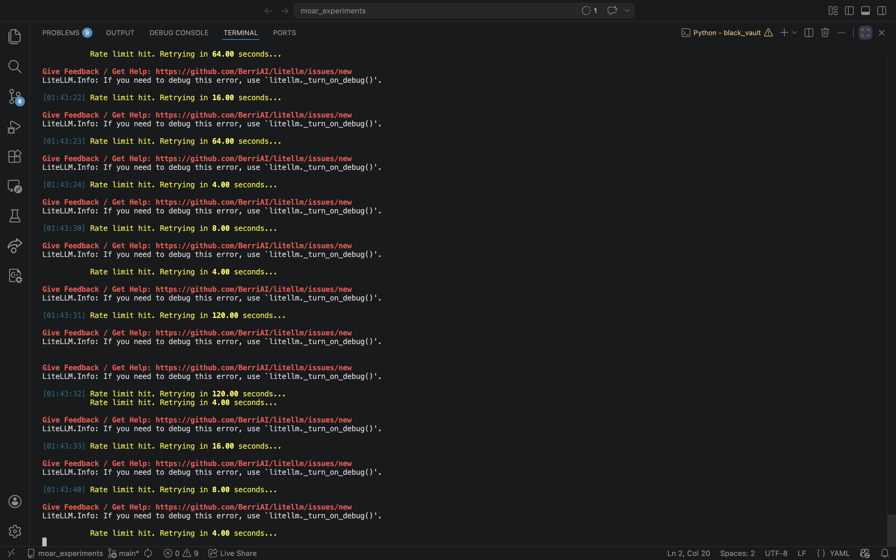
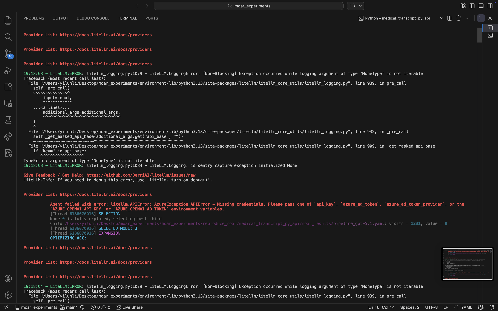

# moar_experiments
To demonstrate the code synthesis directive, I have chosen 
CUAD and black_vault to replicate. 

Replicating the original experiments presented several challenges:
The authors of the paper did not include the specific data they fed to docetl,
For example, cuad has the dataset and ground truth published here:
https://huggingface.co/datasets/theatticusproject/cuad/tree/main/CUAD_v1
https://huggingface.co/datasets/theatticusproject/cuad/blob/main/CUAD_v1/master_clauses.csv

However, the author of docetl did not use the exact CUAD_v1, given that copying their baseline from the paper would generate errors on it.
The setup for the dataset is unclear, but from the paper and their website, it may be a flattened json list derived from CUAD_v1 with each element being the context of a legal document. 

Aside from input data, litellm also presented problems:
Rate limit is always a thing even though I have 20 usd of credits in my openai account and valid billing info

This would happen with large dataset such as the black_vault, and moar optimization (even when the dataset is very small)

Another issue with moar optimization agents is below:
.
It happens even when I follow the tutorial example: https://ucbepic.github.io/docetl/optimization/moar/examples/#key-points
which makes me suspect bugs within lithllm.

Update: Litellm's azure credential problem has been fixed now.
Ratelimit error persists, I think I need a tier increase on openai's side
which cannot be done manually by the user.

Currently, any pipeline with MOAR is impossible. For a dataset of blackvault's size (https://osf.io/57ryp/files/osfstorage), rate limit would also stop docetl run pipeline.yaml to finish. 

